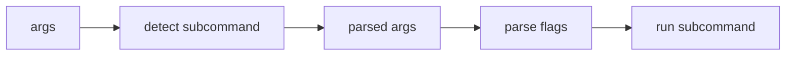

# cli

cli framework for v

## Refs

- flag: https://github.com/vlang/v/tree/master/vlib/flag

## Architecture

```mermaid
flowchart LR
    args --> id1[detect subcommand]
    id1 --> id2[parsed args]
    id2 --> id3[parse flags]
    id3 --> id4[run subcommand]

```
